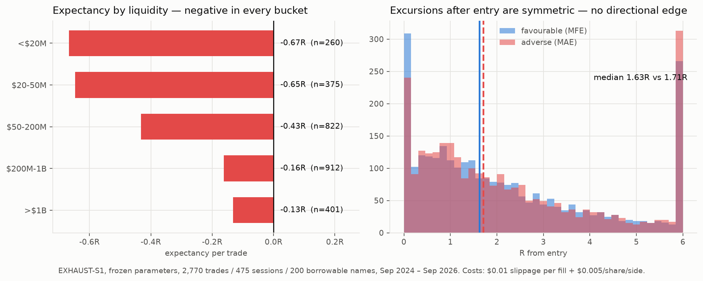

# EXHAUST-S1 — VWAP Backside Continuation Short

**Verdict: REJECTED.** Tested as specified, with parameters frozen before the run,
on 2,770 trades across 475 sessions and 200 borrowable names. Expectancy
**−0.351R**, profit factor **0.605**, day-clustered **t = −4.63**. Negative in the
development period (−0.352R) and negative in the untouched holdout (−0.349R).



---

## 1. The strategy as tested

Implemented exactly as specified, on M5 RTH bars, one trade per symbol-day:

1. price below session VWAP
2. EMA9 < EMA20
3. price bounces back to within 0.2% of VWAP
4. the bounce **fails to reclaim VWAP on a closing basis**
5. the bounce is a **lower high** than the session high
6. a later candle breaks below the bounce candle's low (within 4 bars)
7. short on the following bar
8. stop = bounce high + 0.15 × ATR14(M5); reject if stop > 4% from entry
9. target 2.0R
10. entry window 09:45–11:30 ET; cover by the close, never overnight

Frozen risk model: risk ≤ $150/trade, max 1,000 shares, $0.01 adverse slippage per
fill, $0.005/share/side commission. Entry rejected if filled more than 0.5% below
the trigger ("next-bar limit within 0.5%"). When one bar touches both stop and
target, the **stop** is taken.

The setup funnel behaves as designed, so this is not a detection failure — of 397
in-play sessions: 223 reached the backside regime, 161 produced a failed VWAP
reclaim, 160 of those were lower highs, 123 confirmed with a break, and 84 became
entries (33 rejected for chasing, 6 for a too-wide stop).

## 2. Results

**The specified universe** ($1–20, gap/run ≥20%, RVOL ≥3, dollar volume ≥$5M,
borrowable) yields very few trades, and they are negative:

| Universe | n | win | expectancy | PF | net P&L |
|---|---|---|---|---|---|
| **spec: $1–20 / ≥20%** | 20 | 40.0% | **−0.190R** | 0.77 | −$148 |
| $1–20 / ≥15% | 43 | 32.6% | −0.454R | 0.53 | −$1,656 |
| any price / ≥20% | 43 | 39.5% | −0.023R | 0.97 | +$259 |
| any price / ≥15% | 84 | 35.7% | −0.283R | 0.68 | −$2,435 |

Target choice does not rescue it (n=84): 1R −0.287R, 1.5R −0.435R, 2R −0.283R,
3R −0.270R. Entry convention does not either — a resting stop order at the trigger
gives −0.291R (n=111) versus −0.283R for next-bar-open.

**Dropping the in-play screen** to get statistical power — the same pattern on
every borrowable session with >$5M dollar volume:

| Period | n | days | win | expectancy | PF | clustered t |
|---|---|---|---|---|---|---|
| Development (to 2025-12-31) | 1,604 | 306 | 36.5% | −0.352R | 0.61 | −3.45 |
| **Holdout (2026)** | 1,166 | 169 | 34.6% | **−0.349R** | 0.59 | −5.10 |
| All | 2,770 | 475 | 35.7% | −0.351R | 0.61 | −4.63 |

The holdout requirement — "expectancy > 0 after costs" — fails decisively.

## 3. Why it loses

Two independent reasons, and neither is fixable by tuning.

**There is no directional edge.** After entry, the median favourable excursion is
1.63R and the median adverse excursion is 1.71R. Those are the same number. The
pattern reliably identifies a moment of *high volatility*, but price is no more
likely to go down from there than up. Everything after that is a coin flip being
charged a spread.

**Realised losses exceed 1R.** Mean loss is −1.38R against a mean win of +1.50R,
because a 5-minute bar in an in-play name routinely gaps straight through a
structural stop (7.8% of exits are gap-throughs). The arithmetic then closes
itself: 0.357 × 1.50 − 0.643 × 1.38 = −0.35R.

This is also why expectancy improves monotonically with liquidity — mean loss
falls from −1.64R in sub-$20M names to −1.18R above $1B — but it never crosses
zero. **The borrow constraint makes this worse, not better:** of 600 most-active
names, 0 of 42 sub-$1 and 0 of 74 $1–5 names were shortable, and 0 of the 11 names
that moved ≥20% that day were shortable. Borrowable "small-cap" is really $5–20,
and only 9 of 182 spec events were under $5. The low-float runners the setup is
designed for are the ones you cannot borrow.

## 4. On the 8-trade TSLA result

Your report is not in this repo, so I could not re-run it; TSLA is not in my M5
panel either. But the result is reproducible as noise. Taking my most-liquid
bucket (>$1B/day, the closest analogue to TSLA/TSLL) where true expectancy is
**−0.132R**, and drawing 8 trades at random 200,000 times:

- P(observing ≥ +0.52R) = **10.6%**
- P(observing *any* positive expectancy) = **43.1%**
- 90% range of an 8-trade expectancy: **[−1.04R, +0.79R]**
- standard error at n=8: **0.59R**

A losing strategy shows a positive 8-trade sample **43% of the time**, and shows
your specific +0.52R about one time in ten. Separating −0.13R from +0.52R at 95%
confidence needs ~26 trades; establishing that a positive edge exists at all needs
far more.

The 1R/1.5R/2R monotonicity is weaker evidence than it looks, too: those three
numbers come from the *same 8 trades*, so they are one observation viewed three
ways, not three independent confirmations. In my 84-trade sample the same
monotonicity does not appear.

## 5. What I'd take from this

The reframe was right — starting from something already positive beats forcing a
small-cap short until it turns green. This one just wasn't positive; it only
looked that way at n=8.

Worth noting what *did* survive contact with a larger sample. In the sibling study
(`README.md`), unconditional short entries had no out-of-sample edge, while
entries that required the open to **fail first** kept theirs (+64 bps OOS, versus
+24 bps for shorting the open). That is the same "wait for bulls to fail" instinct
behind EXHAUST-S1, and it does carry signal — the failure here is specifically
that VWAP-reclaim structure on in-play names cannot pay for its own stop slippage.

If you want to keep going down this road, the two things that would actually
change the answer:

1. **Test on 1-minute bars.** A 5-minute bar hides the path, and stop slippage is
   exactly the variable that kills this. If the stop is executable at 1-minute
   granularity the loss distribution changes materially.
2. **Move up the liquidity curve, not down.** The gradient in the chart is real
   and monotone. If any version of this works it is in $200M+/day names, which is
   also where borrow actually exists — but note that the best bucket is still
   −0.13R, so the burden of proof is high.

## 6. Data and caveats

- **Universe:** 5,939 US common stocks enumerated; 1,367 shortable. Borrow status
  is the vendor's **current** flag, not point-in-time — a real limitation, since
  borrow on these names changes daily. It is also one broker's list; a
  short-focused prime broker has deeper locates, often paid.
- **Panel:** 562 names of daily bars; 467,338 M5 RTH bars over 6,010 sessions.
- **Reconciliation:** every M5 session is checked against its daily bar; 51 of
  6,010 disagreed by >0.5% on the extremes and were dropped. Nine symbols came
  back on an unadjusted basis and were rescaled.
- **A bug worth recording:** the first version of `ingest_daily.py` globbed every
  bar dump without filtering timespan, so M5/M15 bars were ingested as daily rows
  (69,180 duplicate symbol-dates). Reconciliation caught it. Fixed by requiring an
  empty `trading_session`. The previously committed daily panel was verified clean
  and the sibling study is unaffected.
- **Sample:** two years, one broad regime. Session-anchored VWAP and EMAs (a
  continuous intraday EMA would need prior-session M5 bars, which were not pulled).

## 7. Running it

```bash
python3 src/s1_events.py    # borrowable in-play screen -> data/s1_events.csv
python3 src/s1_ingest.py    # M5 panel + reconciliation
python3 src/s1_run.py       # spec universe, dev vs holdout
python3 src/s1_plot.py      # out/s1_diagnosis.png
```

`src/exhaust_s1.py` holds the pattern and the frozen `PARAMS`.
