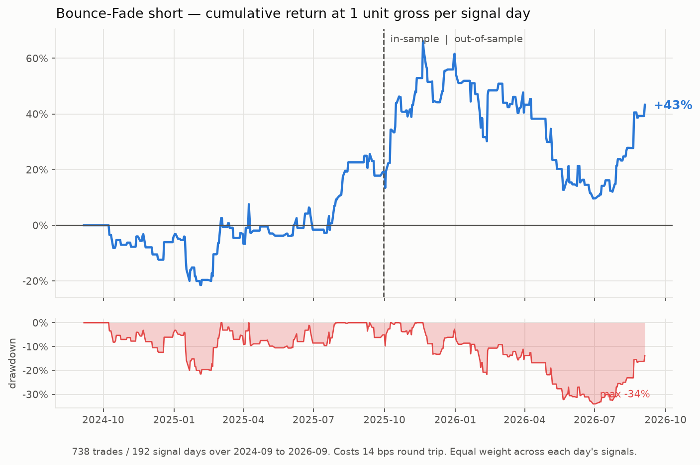

# Intraday short-strategy research

Two studies live here:

| Study | Verdict |
|---|---|
| **Bounce-Fade** (this file) | positive point estimate, not statistically significant |
| **[EXHAUST-S1](EXHAUST-S1.md)** — VWAP backside continuation short | **rejected**: −0.351R over 2,770 trades, negative in dev and holdout |

---

# Bounce-Fade: an intraday RTH short strategy

A short-biased, intraday-only strategy for US equities. Every position opens and
closes inside regular trading hours — nothing is ever held overnight.

**Headline:** positive expected value on the point estimate, stable across a clean
in-sample / out-of-sample split (25.9 vs 23.5 bps per signal day), but the profit
is **episodic**, and the out-of-sample edge is **not statistically significant**
once you cluster errors by day. Read "Honest limitations" before trading it.



---

## 1. The thesis

The first thing the research said was that the obvious short-biased trade is wrong.

Bucketing every gap in the universe by size, gap-ups do fade — but only in a
specific state. Splitting the 3–12% gap-up pool by where the stock sat relative to
its own 20-day mean:

| Prior close vs SMA20 | n | Short EV | % down days |
|---|---|---|---|
| **below −2%** | 1336 | **+166 bps** | 66.6% |
| −2% to +2% | 536 | −14 bps | 50.4% |
| +2% to +6% | 498 | −35 bps | 47.4% |
| +12% to +25% | 348 | −6 bps | 57.8% |

Shorting *extended, strong* names — the instinctive "it's gone too far" trade —
has **negative** expected value. The money is on the other side: a name already in
a downtrend that gaps up is being handed a relief pop, and that pop gets
distributed into. So the strategy fades bounces in weak names, not strength in
strong ones.

Two other findings shape the rules:

- **The gap cap is a risk control, not an edge.** In the *unconditional* pool,
  gap-ups above 10% do flip to a coin flip with a fat right tail (mean stock
  open→close +29 bps against a negative median). But once the downtrend filter is
  applied that reverses — large conditioned gaps fade at least as well, and
  removing the cap entirely moves out-of-sample EV by 0.5 bps (64.1 → 64.6) across
  15 extra trades. The 12% cap is kept as a **deliberate guard against the squeeze
  tail**, not because it is earning anything measurable.
- **Entry must be confirmed.** Shorting the opening print unconditionally has no
  out-of-sample edge (see §5). Waiting for the open to actually fail is what
  carries the entire result.

## 2. The rules

**Universe** — point-in-time, evaluated on prior-session data only:
- prior close ≥ $5 (borrowable; avoids sub-$5 locate and tick problems)
- 20-day median dollar volume ≥ $25M (can short size into it)
- ATR(14) ≥ 4% of price (the name actually moves)

**Signal**, all known before 09:30:
- gap = `open / prev_close − 1`, with **+3% ≤ gap ≤ +12%**
- **prev_close < SMA20** — the downtrend condition, the core of the edge

**Entry — `orb_down_red` (the opening flush).** Both conditions required:
1. the 09:30–09:45 bar closes **red** (the pop failed), and
2. price then **breaks the low of that bar**; short at the break level.

If either never happens, no trade. This is why only 738 trades come from 1,754
signals — most days the setup simply never confirms.

**Exit**, in priority order:
- hard stop at **entry × 1.05**;
- otherwise cover on the **15:45 bar close**. No overnight risk.

Profit targets were tested (2/3/5/8%) and all made it worse — a 2% target cut EV
from 57 to 3 bps out-of-sample. The fat left tail is paid for by letting winners
run to the close, so the strategy takes a lower win rate in exchange for size.

## 3. Data

| | |
|---|---|
| Source | Webull MCP (`get_stock_bars`), the only reachable feed in this sandbox |
| Universe | 419 liquidity-screened US names; 60 with full intraday coverage |
| Daily | 202,145 split-adjusted RTH bars, 2024-09-09 → 2026-09-04 |
| Intraday | 743,756 M15 RTH bars (26 bars/session, 09:30–15:45) |
| Costs | 5 bps slippage + 2 bps commission **per leg** = 14 bps round trip |

Two data defects were found by reconciling intraday against daily bars and fixed
in `src/clean_intraday.py`:

1. **Nine symbols** (HMY, ASST, AMKR, LRCX, SBET, BMNR, HL, AG, NBIS) returned
   intraday bars on an *unadjusted* basis while daily bars were adjusted — a
   silent 20:1 error on ASST. Each session is rescaled by
   `daily_close / intraday_session_close`, a no-op where they already agree.
2. **262 sessions (0.9%)** where daily and intraday high/low disagree by >0.5% —
   excluded, since the dangerous direction is intraday missing a spike, which
   would understate stop-outs.

The daily `open` is the official auction print while the first M15 bar opens at
the first consolidated trade; these legitimately differ (σ ≈ 37 bps), so the daily
open is used only to measure the gap, never as a fill.

**Conservative by construction:** when one bar touches both stop and target, the
stop is taken; a bar that gaps through the stop fills at its open, which is worse
than the stop level; costs are charged on both legs.

## 4. Results

**Trade level** (738 trades):

| | n | EV | median | win | profit factor | worst |
|---|---|---|---|---|---|---|
| In-sample | 284 | +202 bps | +125 | 63.7% | 2.87 | −7.6% |
| **Out-of-sample** | 454 | **+64 bps** | +43 | 55.7% | 1.57 | −4.9% |
| All | 738 | +117 bps | +68 | 58.8% | 2.06 | −7.6% |

Exits: ~86% cover at the close, ~14% stop out. The stop is a tail guard, not a
primary exit.

**Day level** — the honest unit of risk, since trades cluster on the same days.
Equal weight across that day's signals, 1 unit gross per day:

| | active days | bps/day | ann. Sharpe | max DD | P(EV>0) | 90% CI (bps/day) |
|---|---|---|---|---|---|---|
| In-sample | 88 | 25.9 | 0.69 | −21% | 76% | [−34, +87] |
| **Out-of-sample** | 104 | **23.5** | 0.72 | −34% | 76% | [−30, +79] |
| All | 192 | 24.6 | 0.70 | −34% | 84% | [−16, +66] |

The in-sample and out-of-sample daily means agreeing to within 2.4 bps is the
strongest evidence here that something real is being measured.

## 5. What validates, and what doesn't

**The entry rule replicates.** In-sample ranking held out-of-sample: the two
confirmation entries kept their edge while all three unconditional entries
collapsed to noise.

| Entry | IS EV | OOS EV | OOS naive *t* | OOS clustered *t* |
|---|---|---|---|---|
| short the open | +123 | +24 | 1.56 | 0.44 |
| short 09:45 close | +80 | +15 | 1.20 | — |
| first bar red | +183 | +57 | 3.09 | 1.03 |
| break of opening low | +142 | +53 | 3.47 | 1.02 |
| **red + break (chosen)** | **+202** | **+64** | 3.40 | **1.25** |

**Parameters are not a knife-edge.** Across a 108-config grid (gap min/max, ATR
floor, stop), 82% were profitable, median 41.6 bps/day. The chosen config (24.6)
sits *below* the median — it is not perched on the peak.

**No single name carries it.** Leave-one-symbol-out moves the result between 17.2
and 31.9 bps/day against a 24.6 baseline.

**Caveat on the day-level metric.** With only ~190 active days, bps/day is noisy:
varying the gap cap alone swings it between 13.9 and 31.1 while trade-level EV
barely moves (199–205 bps IS). Trade-level EV is the more stable estimator; the
day-level figure is the more honest risk unit. Both are reported.

**Costs bite, but not fatally.** Out-of-sample EV by round-trip cost:

| RT cost | 0 | 7 | 14 (used) | 25 | 40 | 55 bps |
|---|---|---|---|---|---|---|
| OOS EV | 78 | 71 | **64** | 53 | 38 | 23 bps |
| PF | 1.74 | 1.65 | **1.57** | 1.45 | 1.31 | 1.18 |

The point estimate stays positive even at 55 bps, though by then it is well inside
the noise band. Execution quality matters but is not the binding constraint.

**Regime timing failed and was dropped.** Gating on SPY < SMA20 or elevated
realized vol looked excellent in-sample (the best gate hit +368 bps) and **flipped
negative out-of-sample (−36 bps)**. The in-sample vol relationship did not
replicate at all. It is not in the strategy.

## 6. Honest limitations

1. **The out-of-sample edge is not statistically significant.** Naive *t* ≈ 3.4
   treats 454 trades as independent; they are ~104 correlated daily bets, all
   short, all in high-beta names. Clustered by day, *t* = 1.25 and the bootstrap
   gives P(EV>0) = 76%. Roughly a **1-in-4 chance the true edge is zero or
   negative.**
2. **Profits are episodic.** Dropping the single best month takes out-of-sample EV
   from +64 bps to roughly zero. This is closer to crisis alpha than to a smooth
   daily earner — it pays in stressed tape and treads water otherwise. The
   equity curve shows a −34% drawdown lasting most of 2026.
3. **Two years, one regime.** 2024-09 to 2026-09 is what the vendor returns at
   depth. It contains two big volatility events; a decade would contain many.
4. **Universe selection bias.** The 60 intraday names were chosen as the most
   frequent signal generators — i.e. selected on volatility. They skew heavily to
   crypto-miners, AI and quantum speculatives, so sector risk is concentrated and
   the names are correlated with each other. Selection is on volatility, not on
   returns, which is the milder failure mode, but it is real.
5. **Survivorship.** Only currently-listed symbols are reachable. For a *short*
   strategy this biases results **against** us (names that delisted to zero are
   missing), so it is conservative.
6. **Borrow is not modelled.** Intraday-only means no overnight borrow, but locate
   fees on hard-to-borrow names are real and are not in the 14 bps.
7. **M15 granularity.** The break-of-opening-low fill is assumed at the break
   level. On a fast flush the real fill is worse; 1-minute data would tighten this.

## 7. How to trade it, if you do

- Size on the **day**, not the trade: one unit of risk per session split across
  that day's signals. The −34% drawdown is at 1 unit gross per signal day; at 0.25
  units it is ≈ −9%.
- Expect **~100 active days a year** and long flat stretches. It is an overlay,
  not a standalone book.
- Keep it in liquid, easy-to-borrow names. The edge dies at 40 bps of friction.
- Re-run the validation annually. An edge this episodic needs monitoring.

## 8. Running it

```bash
python3 src/ingest_daily.py      # raw dumps  -> data/daily_panel.csv
python3 src/ingest_intraday.py   # raw dumps  -> data/intraday_m15.parquet
python3 src/clean_intraday.py    # adjust + reconcile against daily
python3 src/run_backtest.py      # trade + day-level results
python3 src/plot_equity.py       # out/equity_curve.png
```

| File | Purpose |
|---|---|
| `src/features.py` | point-in-time daily features; IS/OOS split |
| `src/strategy.py` | the rules and parameters |
| `src/backtest.py` | intraday engine, entry rules, conservative fills |
| `src/run_backtest.py` | results, day-level portfolio, bootstrap |
